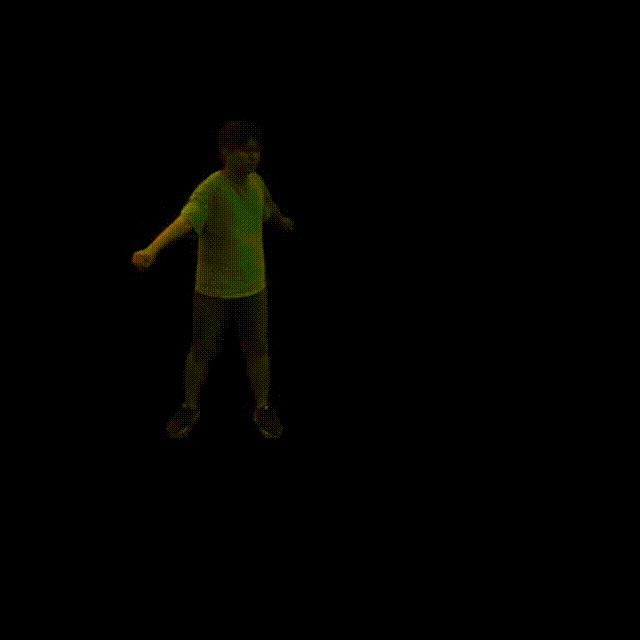
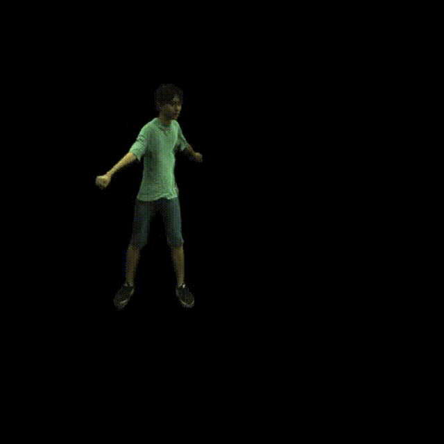
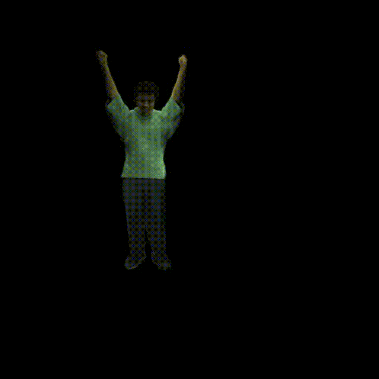
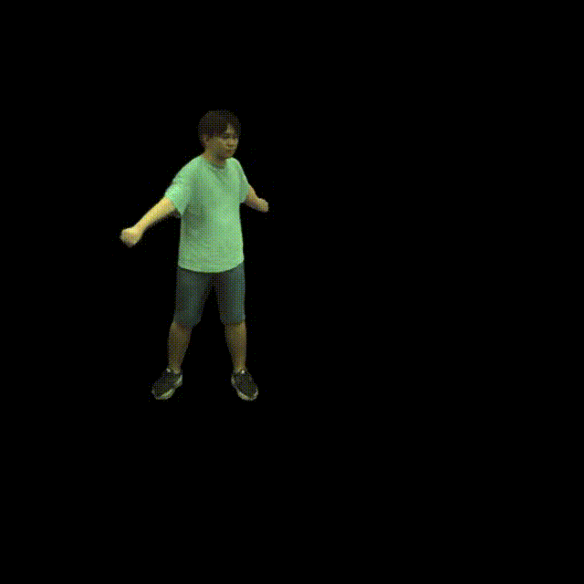

# NECA: Neural Customizable Human Avatar
## [Paper](https://arxiv.org/abs/2403.10335)
This is official code of CVPR2024 paper [NECA: Neural Customizable Human Avatar](https://arxiv.org/abs/2403.10335).

## Installation

### Set up the python environment

```commandline
conda create -n neca python=3.8
conda activate neca

# install pytorch
conda install pytorch==1.12.0 torchvision==0.13.0 torchaudio==0.12.0 cudatoolkit=11.6 -c pytorch -c conda-forge

# install pytorch3d (linux only)
conda install -c fvcore -c iopath -c conda-forge fvcore iopath
conda install pytorch3d -c pytorch3d

pip install -r requirements.txt
conda install igl -c conda-forge
```

### Set up datasets
#### ZJU-Mocap
Please follow [neuralbody](https://github.com/zju3dv/neuralbody) to download the ZJU-Mocap dataset.

Then make a soft link and prepare dataset:
```commandline
ln -s /path/to/your/dataset ./data/zju_mocap
python lib/tools/process_dataset.py
```

#### SMPL
Down neutral SMPL model from [here](https://smplify.is.tue.mpg.de/) and unpack ```mpips_smplify_public_v2.zip```. 
Using [this page](https://github.com/vchoutas/smplx/tree/main/tools) to remove Chumpy objects from the SMPL model.
Copy it to ```data/smpl_model``` and rename it as ```SMPL_NEUTRAL.pkl```.

The final ```data``` folder should be like this:
```
data
  ├-- zju_mocap
  ├-- params
  ├-- uvmapping.obj
  └-- smpl_model
    └-- SMPL_NEUTRAL.pkl
```

## Trainning
```commandline
python run.py --task train --cfg config/zju_mocap/313.yaml
```

## Evaluation
```commandline
python run.py --task evaluate --type novel_view --cfg config/zju_mocap/313.yaml
python run.py --task evaluate --type novel_pose --cfg config/zju_mocap/313.yaml
```

## Editing
### Relighting
Download HDR maps from [here](https://polyhaven.com/hdris) and put it into ```light-probes```
```commandline
python run.py --task visualilze --type relight --cfg config/zju_mocap/313.yaml hdr_path YOUR_HDR_MAP.hdr
```
We provide script to make a video:
```commandline
python lib/tools/make_video.py --path ./result/313_sdf_nerf/visualize/relight-YOU_HDR_MAP-frame0 --size 512
```

### Reshape
```commandline
python run.py --task visualize --type reshape --cfg config/zju_mocap/313.yaml reshape 0,4
python lib/tools/make_video.py --path ./result/313_sdf_nerf/visualize/reshape --size 512
```

### Retexture
Please change the parameters located at [config/default.yaml#L205](config/default.yaml#L205) to reflect your desired settings for both upper and lower body.
Additionally, refine the bounding box in [./lib/renderers/recloth.py#L14](./lib/renderers/recloth.py#L14) to improve the quality of the outcomes.
```commandline
python run.py --task visualize --type recloth --cfg config/zju_mocap/315.yaml
python lib/tools/make_video.py --path ./result/315_sdf_nerf/visualize/recloth --size 512
```


### Rendering without shadow
```commandline
python run.py --task visualize --type relight --cfg config/zju_mocap/313.yaml drop_shadow True hdr_path self
python lib/tools/make_video.py --path ./result/313_sdf_nerf/visualize/relight--frame0/drop-shadow --size 512
```

## Citation
If you find this code useful for your research, please cite this:
```
@inproceedings{NECA2024CVPR,
    title={NECA: Neural Customizable Human Avatar},
    author={Xiao, Junjin and Zhang, Qing and Xu, Zhan and Zheng, Wei-Shi},
    booktitle={CVPR},
    year={2024}
}
```